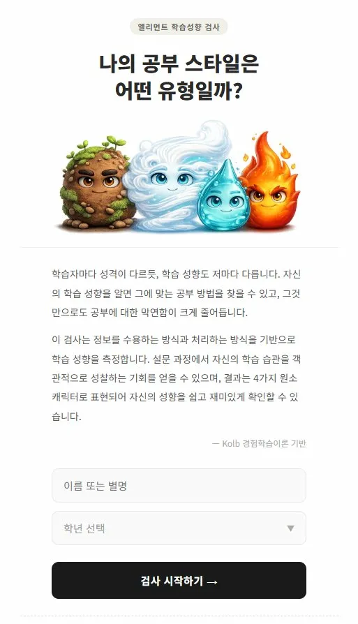
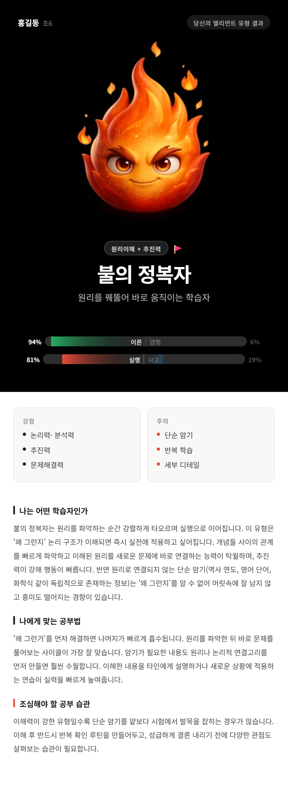
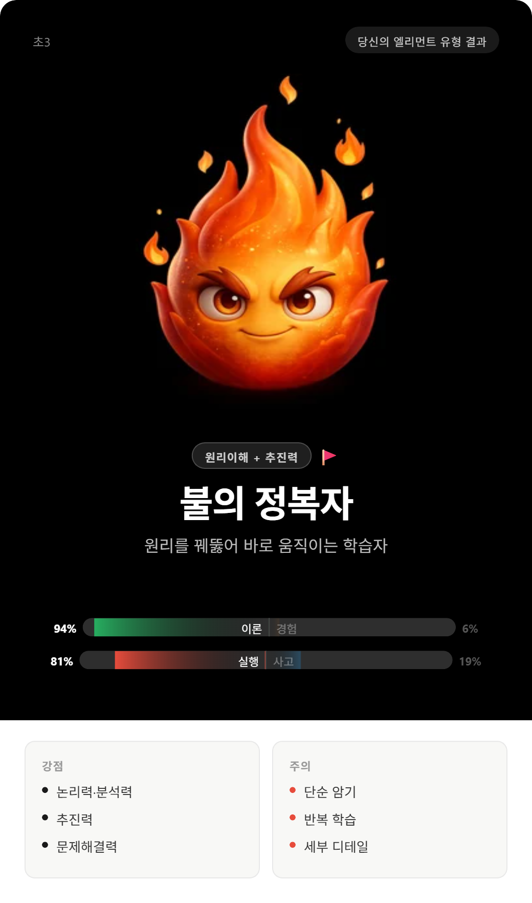
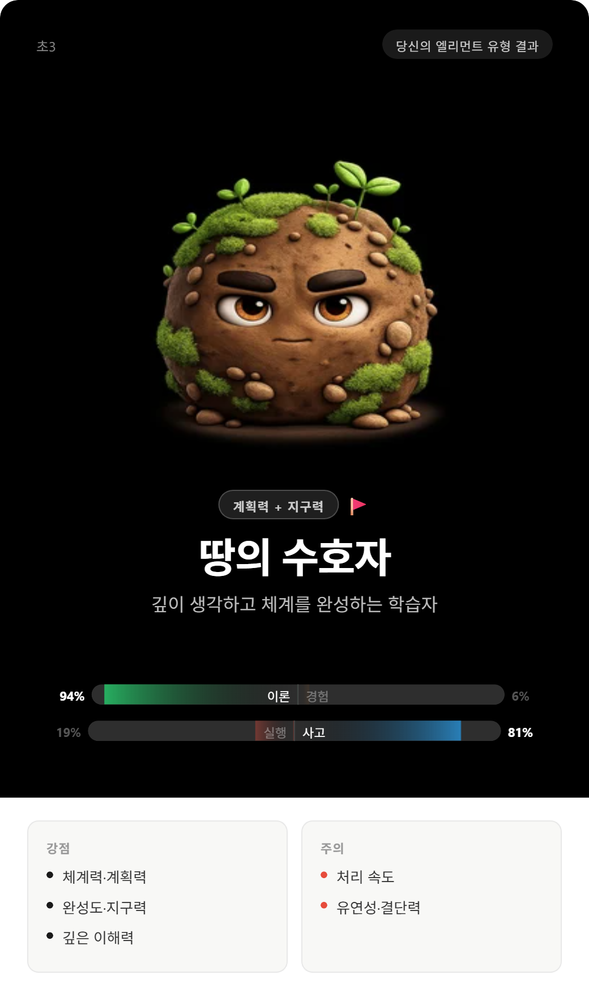
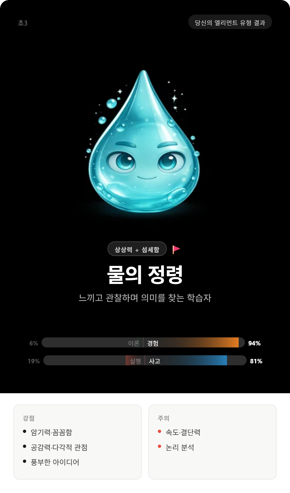
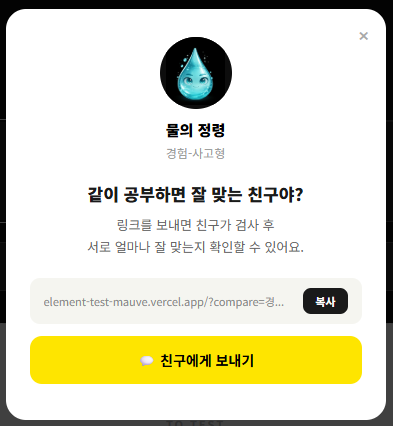
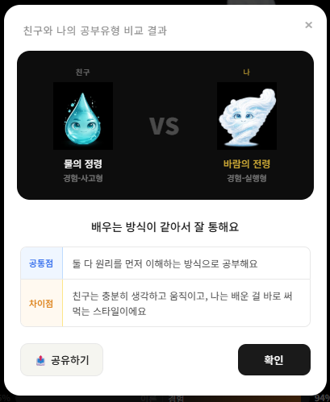
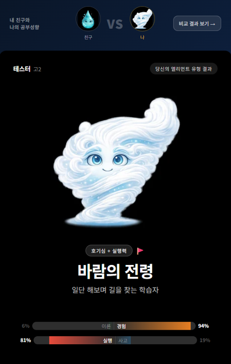
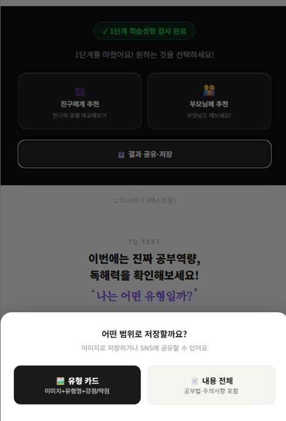
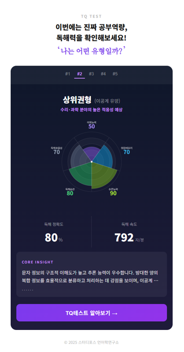

# 엘리먼트 학습성향 검사 시스템 가이드

## 한 줄 요약
**Kolb의 경험학습이론을 기반으로, 학습자의 공부 스타일을 4가지 원소 캐릭터 유형으로 진단하는 온라인 검사 시스템**

---

## 1. 시스템의 목적

엘리먼트 학습성향 검사는 "나의 공부 스타일은 어떤 유형일까?"라는 질문에 답하는 시스템입니다.

### 왜 학습성향인가?
- 같은 내용을 배워도 **학습자마다 효과적인 공부법이 다름**
- 자신의 학습 성향을 알면 **맞는 공부 방법을 찾을 수 있고**, 공부에 대한 막연함이 줄어듦
- 정보를 수용하고 처리하는 방식의 차이를 **과학적으로 측정** (Kolb 경험학습이론)

### 누구를 위한 시스템인가?
- **초등 3학년 ~ 고등학생**: 자신의 공부 스타일 파악
- **N수생/일반 성인**: 학습 전략 점검
- **학부모**: 자녀의 학습 성향 이해

### 시작 화면


### TQ 시스템과의 관계
엘리먼트 검사는 **1단계 검사(학습성향)**이고, TQ 테스트는 **2단계 검사(독해역량)**입니다. 엘리먼트로 가볍게 학습 성향을 파악한 뒤, TQ로 독해역량을 정밀 진단하는 흐름으로 설계되어 있습니다.

```
[엘리먼트 학습성향 검사] → [TQ 독해역량 테스트] → [AI 판독 + 맞춤 훈련]
      1단계: 성향 파악          2단계: 역량 진단          3단계: 처방
```

---

## 2. 이론적 배경

### Kolb의 경험학습이론

학습은 2가지 축으로 구분됩니다:

| 축 | 한쪽 극 | 다른 쪽 극 | 의미 |
|---|--------|----------|------|
| **축1: 정보 수용** | 이론 (추상적 개념화) | 경험 (구체적 경험) | 정보를 받아들이는 방식 |
| **축2: 정보 처리** | 실행 (능동적 실험) | 사고 (반성적 관찰) | 받아들인 정보를 처리하는 방식 |

이 2개 축의 조합으로 **4가지 학습자 유형**이 만들어집니다.

---

## 3. 4가지 유형

### 결과 화면 예시


### 4가지 유형 카드
| 🔥 불의 정복자 | 🌪️ 바람의 전령 | 🪨 땅의 수호자 | 💧 물의 정령 |
|:---:|:---:|:---:|:---:|
|  |  |  |  |

### 🔥 불의 정복자 (이론 + 실행)
> 원리를 꿰뚫어 바로 움직이는 학습자

| 항목 | 내용 |
|------|------|
| **키워드** | 원리이해 + 추진력 |
| **강점** | 논리력·분석력, 추진력, 문제해결력 |
| **약점** | 단순 암기, 반복 학습, 세부 디테일 |
| **맞는 공부법** | "왜 그런가"를 먼저 해결하면 나머지가 빠르게 흡수됨. 원리를 파악한 뒤 바로 문제를 풀어보는 사이클이 최적 |

### 🌪️ 바람의 전령 (경험 + 실행)
> 세상을 직접 부딪혀 배우는 학습자

| 항목 | 내용 |
|------|------|
| **키워드** | 호기심 + 실행력 |
| **강점** | 추진력·도전정신, 높은 적응력, 실행력 |
| **약점** | 원리 이해 부족, 지속력·완성도 |
| **맞는 공부법** | 직접 해보면서 배우는 방식이 효과적. 실험, 프로젝트, 체험 학습에서 강점 발휘 |

### 🪨 땅의 수호자 (이론 + 사고)
> 단단한 기초 위에 성을 쌓는 학습자

| 항목 | 내용 |
|------|------|
| **키워드** | 계획력 + 지구력 |
| **강점** | 체계력·계획력, 완성도·지구력, 깊은 이해력 |
| **약점** | 처리 속도, 유연성·결단력 |
| **맞는 공부법** | 체계적 계획 + 반복 학습이 최적. 노트 정리, 개념 맵핑, 단계별 학습에서 강점 발휘 |

### 💧 물의 정령 (경험 + 사고)
> 깊이 느끼고 다각도로 바라보는 학습자

| 항목 | 내용 |
|------|------|
| **키워드** | 상상력 + 섬세함 |
| **강점** | 암기력·꼼꼼함, 공감력·다각적 관점, 풍부한 아이디어 |
| **약점** | 속도·결단력, 논리 분석 |
| **맞는 공부법** | 이미지·스토리로 기억하는 방식이 효과적. 시각 자료, 연상법, 그룹 토론에서 강점 발휘 |

---

## 4. 테스트 구성

### 문항 구조
- **총 8개 프레임**, 프레임당 4문항 = **32개 응답**
- **6점 리커트 척도** (중간점 없음) — "전혀 아니다(1)" ~ "매우 그렇다(6)"
- 소요 시간: **약 3~5분**

### 프레임별 테마
| 프레임 | 테마 | 측정 내용 |
|--------|------|----------|
| F7 | 원리 vs 경험 | 이론-경험 축 순수 측정 |
| F8 | 행동 vs 사고 | 실행-사고 축 순수 측정 |
| F1 | 뭔가를 이해할 때 | 내면적 학습 방식 |
| F2 | 처음 접하는 것들 앞에서 | 새로운 정보 대응 방식 |
| F3 | 가장 몰입되는 순간 | 학습 동기 유형 |
| F4 | 벽에 부딪혔을 때 | 문제 해결 전략 |
| F5 | 모둠 활동을 할 때 | 협업 내 역할 |
| F6 | 공부할 때 나는 | 학습 습관 |

순수 축 측정 프레임(F7, F8)을 앞에 배치하여 응답의 기준점을 잡고, 이후 혼합 프레임(F1~F6)에서 다양한 상황별 성향을 측정합니다.

---

## 5. 분석 로직

### 3단계 분석 파이프라인

```
[리커트 응답 32개] → [원시 점수 집계] → [2축 점수 계산] → [베이지안 유형 확률] → [결과]
```

### Stage 1: 원시 점수 집계
각 문항의 응답을 4가지 유형(이론실행/경험실행/이론사고/경험사고)에 배분합니다.

### Stage 2: 2축 점수 계산
```
theta1(이론-경험 축) = (이론실행 + 이론사고) - (경험실행 + 경험사고)
theta2(실행-사고 축) = (이론실행 + 경험실행) - (이론사고 + 경험사고)
```
- theta1 양수 = 이론 우세 / 음수 = 경험 우세
- theta2 양수 = 실행 우세 / 음수 = 사고 우세

### Stage 3: 베이지안 사후 확률
각 유형의 중심점과 분산으로 가우시안 우도를 계산하고, 사전확률(각 25%)을 곱해 사후 확률을 구합니다.

| 유형 | 이론-경험 축 중심 | 실행-사고 축 중심 |
|------|----------------|----------------|
| 불의 정복자 (이론실행) | +34 | +34 |
| 바람의 전령 (경험실행) | -34 | +34 |
| 땅의 수호자 (이론사고) | +34 | -34 |
| 물의 정령 (경험사고) | -34 | -34 |

### 신뢰 등급
| 최고 확률 | 판정 |
|----------|------|
| 70% 이상 | 명확한 유형 |
| 50~69% | 경향이 있는 유형 |
| 50% 미만 | 복합 유형 가능 |

---

## 6. 결과 화면 구성

### 결과 페이지 요소
1. **캐릭터 헤더** — 원소 캐릭터 이미지, 유형명, 슬로건
2. **성향 분포 바** — 이론↔경험, 실행↔사고 퍼센트 게이지
3. **강점/주의 카드** — 2열 그리드
4. **3개 해석 섹션** — "나는 어떤 학습자인가", "나에게 맞는 공부법", "조심해야 할 공부 습관"
5. **친구 비교** — 친구 유형과의 공통점/차이점 자동 분석
6. **TQ 테스트 안내** — 2단계 검사로 유도하는 프리뷰 슬라이드
7. **공유 기능** — 이미지 캡처, 카카오톡 공유, 링크 복사

### 공유/바이럴 기능
- **친구에게 추천**: 내 결과 유형을 포함한 링크 생성 → 친구가 검사 완료 시 VS 비교 화면 자동 노출
- **이미지 캡처**: html2canvas로 카드형/전체 결과를 이미지로 저장
- **카카오톡 딥링크**: 모바일에서 바로 카카오톡 공유

#### 친구 공유 모달
> 링크를 보내면 친구가 검사 후 서로 얼마나 잘 맞는지 확인할 수 있습니다.



#### 유형 비교 (VS)
> 친구와 나의 유형을 비교하여 공통점과 차이점을 자동 분석합니다.

| 비교 화면 | 비교 결과 |
|:---:|:---:|
|  |  |

#### 이미지 저장 (카드 / 전문 선택)
> "결과 공유·저장" 버튼 클릭 시, **유형 카드**(이미지+유형명+강점/약점 요약)와 **내용 전체**(공부법·주의사항 포함) 중 선택하여 이미지로 저장하거나 SNS에 공유할 수 있습니다.

| 저장 범위 선택 화면 | 카드형 저장 결과 | 전문 저장 결과 |
|:---:|:---:|:---:|
|  |  |  |

#### TQ 테스트 연계
> 1단계 검사 완료 후, 2단계 TQ 독해역량 검사로 자연스럽게 유도합니다. TQ 결과 예시를 5가지 유형(최상위~최하위)으로 자동 슬라이드하여 보여주며, PolarArea 차트로 독해역량 5축을 시각화합니다.



---

## 7. 기술 아키텍처

### 기술 스택
| 영역 | 기술 |
|------|------|
| 프레임워크 | Next.js 16 (App Router) |
| UI | React 19, 인라인 스타일 |
| DB | Supabase (element_results 테이블) |
| 배포 | Vercel |
| 이미지 캡처 | html2canvas (CDN 동적 로드) |
| 공유 | Web Share API + 카카오톡 딥링크 + Clipboard API |

### 데이터 저장 (Supabase)
| 필드 | 내용 |
|------|------|
| nickname | 닉네임 |
| grade | 학년 |
| user_code | 자동 생성 코드 (학년코드 + 랜덤 4자) |
| result_type | 4유형 중 하나 |
| top_prob | 최고 확률값 |
| theory_pct / experience_pct | 이론/경험 퍼센트 |
| action_pct / thinking_pct | 실행/사고 퍼센트 |
| confidence_label | 신뢰 등급 |
| answers | 전체 응답 JSON |
| raw_scores | 원시 점수 JSON |

### URL 파라미터
| 파라미터 | 용도 |
|---------|------|
| `?type=이론실행&이론=72&경험=28&실행=65&사고=35` | 결과 직접 복원 (공유 링크) |
| `?compare=경험실행` | 친구 유형 비교 모드 |
| `?ref=E3DEMO` | 추천인 코드 |
| `?v=17` | 버전 파라미터 |

---

## 8. 시스템의 강점

### 1) 학술적 기반
- Kolb의 경험학습이론이라는 검증된 프레임워크 기반
- 베이지안 확률 모델로 단순 점수 합산이 아닌 **통계적 유형 판별**
- 6점 리커트 척도 (중간점 제거)로 응답의 변별력 확보

### 2) 캐릭터 기반 접근성
- 학술적 유형명(이론실행/경험사고 등) 대신 **불·바람·땅·물 원소 캐릭터**로 표현
- 초등학생도 쉽게 이해할 수 있는 직관적 결과
- 공유하고 싶은 매력적인 캐릭터 이미지

### 3) 바이럴 설계
- 친구 비교 기능: "내 유형 vs 친구 유형" → 자연스러운 추천/공유
- 카카오톡/SNS 공유 최적화
- URL 파라미터로 결과 복원 가능 → 링크만으로 결과 확인

### 4) TQ 연계 퍼널
- 가벼운 성향 검사(3~5분)로 진입 장벽을 낮춤
- 결과에서 자연스럽게 "2단계: TQ 독해역량 검사"로 유도
- 학습성향 → 독해역량 → 맞춤 훈련이라는 완결된 흐름

### 5) 모바일 최적화
- 100% 모바일 반응형 설계
- 터치 친화적 UI (리커트 버튼, 스와이프 등)
- 모바일에서 바로 이미지 저장/공유 가능

---

## 9. 파일 구조

| 파일 | 역할 |
|------|------|
| `app/ElementTest.jsx` | 메인 컴포넌트 (2446줄, 모든 핵심 로직/데이터/스타일) |
| `app/TQResultPreview.jsx` | TQ 결과 예시 슬라이드 컴포넌트 |
| `app/api/save-result/route.js` | Supabase 저장 API |
| `lib/supabase.js` | Supabase 클라이언트 설정 |
| `app/layout.js` | 메타데이터 및 레이아웃 |
| `app/globals.css` | 모바일 반응형 CSS |
| `app/opengraph-image.js` | OG 이미지 동적 생성 |

---

## 10. 접속 주소

- **앱**: https://element-test-mauve.vercel.app/?v=17
- **GitHub**: https://github.com/study-force/element-test
